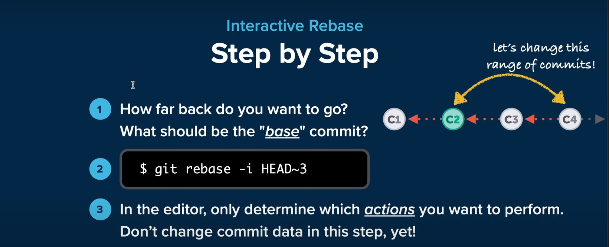

# Interactive Rebase
## A Tool for Optimizing & Cleaning Up Your Commit History

 change a commit's message
• delete commits
• reorder commits
• combine multiple commits into one
• edit / split an existing commit into multiple new ones

<<<<<<< HEAD

# Commands:
1. p, pick <commit> = use commit
2. r, reword <commit> = use commit, but edit the commit message
3. e, edit <commit> = use commit, but stop for amending
4. s, squash <commit> = use commit, but meld into previous commit
5. f, fixup [-C | -c] <commit> = like "squash" but keep only the previous
                    commit's log message, unless -C is used, in which case
                    keep only this commit's message; -c is same as -C but
                    opens the editor
6. x, exec <command> = run command (the rest of the line) using shell
7. b, break = stop here (continue rebase later with 'git rebase --continue')
8. d, drop <commit> = remove commit
9. l, label <label> = label current HEAD with a name
10. t, reset <label> = reset HEAD to a label
11. m, merge [-C <commit> | -c <commit>] <label> [# <oneline>]
         create a merge commit using the original merge commit's
         message (or the oneline, if no original merge commit was
         specified); use -c <commit> to reword the commit message
12. u, update-ref <ref> = track a placeholder for the <ref> to be updated
                       to this position in the new commits. The <ref> is
                       updated at the end of the rebase

## Lets change an old commit message
 1. $ git log --oneline (to show all commits with commit ids in one line)
    1. we can change commit message of last commit using cammand  
       git commit --amend (it will open a new window change commit message from the window)
    2. we can use interactive-rebase commad to change message of any commit.
       git rebase -i HEAD~(type the length of commit from head)||(intead HEAD we can type commit id)
       
     

        

 
 

